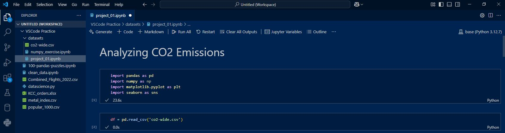
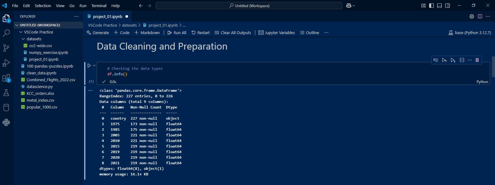
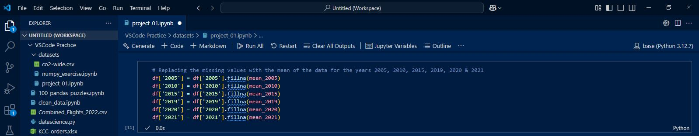
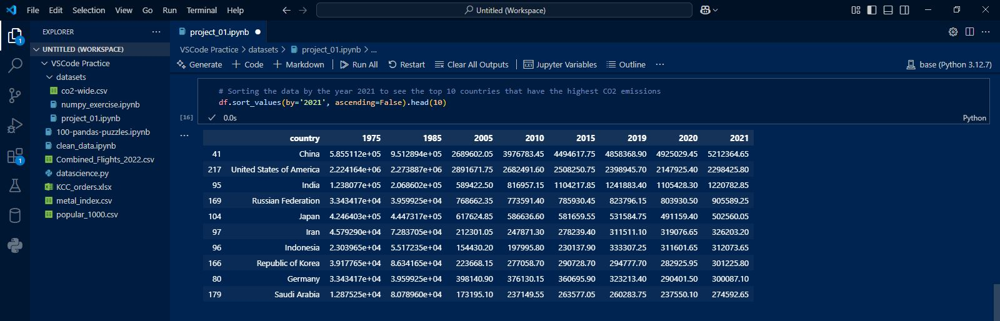
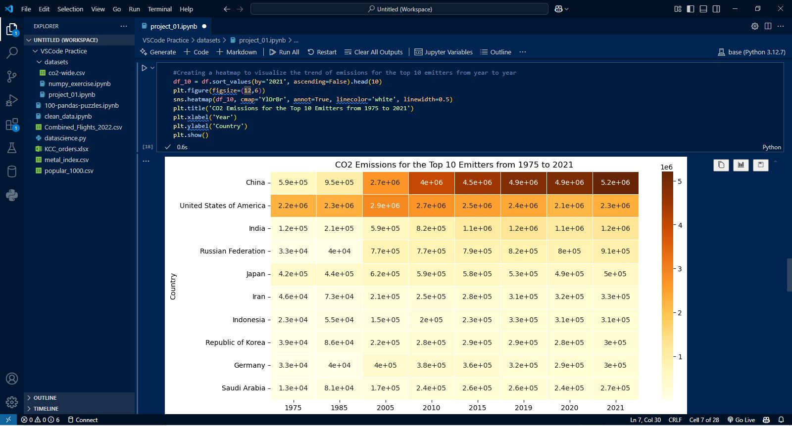
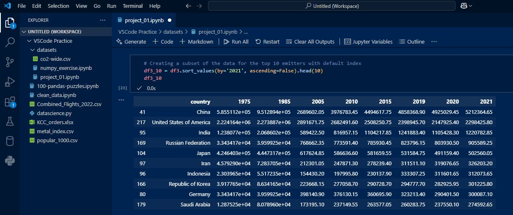
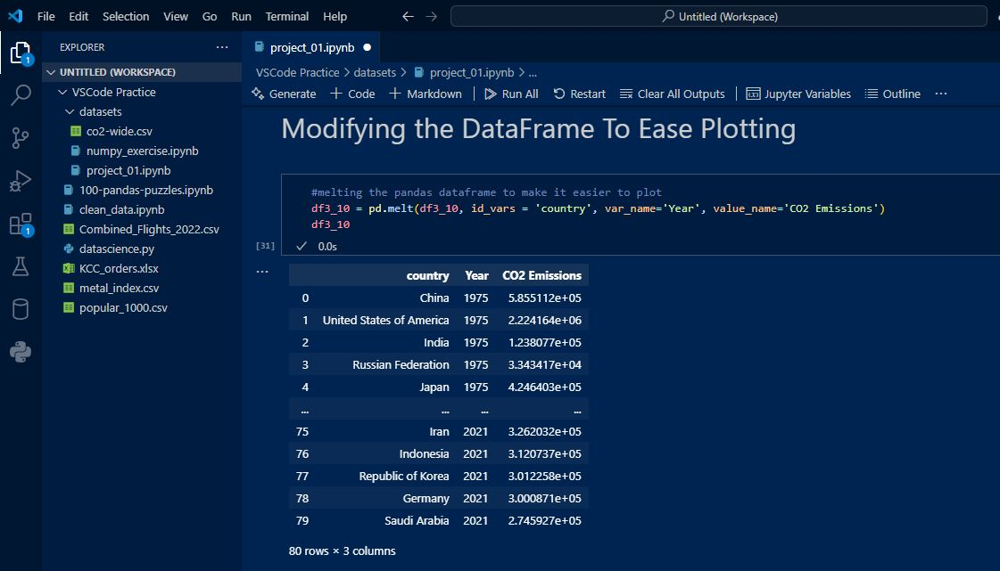
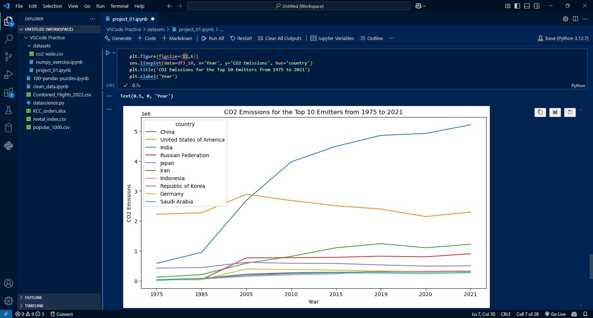

# Analyzing-CO2-Emissions

### Description
The Project involved downloading a CO2 Emissions dataset from Kaggle, loading the dataset into a Pandas DataFrame while using Visual Studio Code, cleaning the data, filling in missing values, formating the dataframe to ease analysis, and creating some visualization.

### Programming Language and Packages Used
#### Python
- Pandas
- Seaborn
- MatplotLib
- Numpy

### Environments and Tools Used
- Windows 10
- Visual Studio Code

### Data Science Analysis Walk-Through

#### Loading the Dataset

#### Data Cleaning and Preparation

#### Replacing missing values with the respective mean

#### Sorting the Data via Most Recent Year with the Highest Emissions

#### Creating a HeatMap to visualize the trend of emissions of top 10 Emitters in 2021

#### Creating a subset of the Top 10 Emitters in 2021

#### Melting the DataFrame To Aid Visualization

#### Creating a Line Plot showing the CO@ Emissions Trend over the Years

